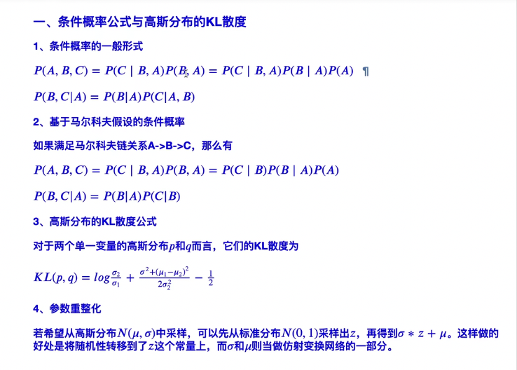
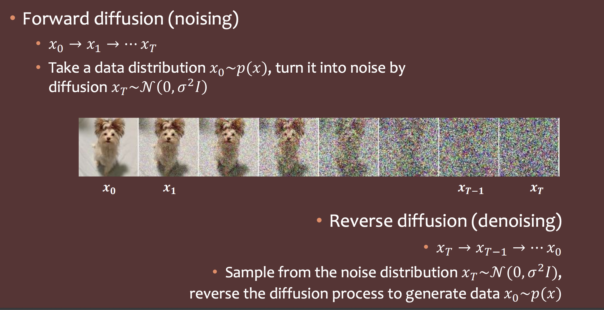
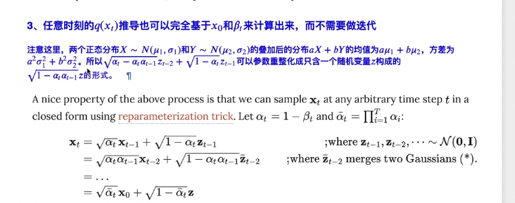
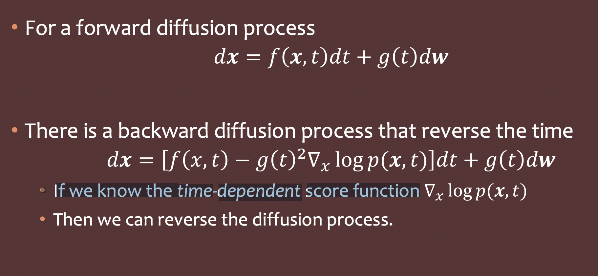

# diffusion扩散生成网络模型

# 扩散模型初了解（ddpm）

学习视频https://www.youtube.com/watch?v=azBugJzmz-o&list=PLJV_el3uVTsOePyfmkfivYZ7Rqr2nMk3W&index=16

## 生成

先从一个噪声采样一个目标的大小的噪声，然后denoise模型按照不同步骤时刻去不同噪声，生成图片

根据输入的当前的图像，以及步骤，生成一个要去掉的噪音图片，然后当前的图像减去噪音，获得新的图片。

## 训练，

训练就是让模型学会如何去生成上面需要去掉的噪声。

先创造训练集，按照步骤给清晰图片添加噪声，获取逐渐模糊的图片，直到完全模糊。这样就有大量的中间照片，添加的噪声，和步骤组成的训练集

然后通过上面的训练集训练模型让他预测添加的噪声。在生成的时候就变成是要减掉的噪声

## 添加文本来影响图片

### 生成

直接把文本放到noise predicter

### 训练

在加噪的时候添加文本，训练模型的时候也添加文本

# 常见的diffusion图片生成模型的框架

https://www.youtube.com/watch?v=JbfcAaBT66U&list=PLJV_el3uVTsOePyfmkfivYZ7Rqr2nMk3W&index=17

一个文本的模型，生成一个向量，一个图片生成模型接受文本和一个图片生成一个中间产物，然后在通过一个模型把中间产物变成一张图片。由三个模型组成，每一个模型是单独训练出来的。

## stable diffusion

## dalle-e

生成图片模型，可以选autorgressive 或者diffusion

## imagen

## 影响生成模型的好坏

改变文本编码模型的大小，看效果两个指标，FID，clip score

越往越右下角效果更好

上图表示，改变encoder模型（文本编码模型）的大小对图片的质量改变很大

这个diffusion模型的大小影响较小

### FID 

代表用生成模型生成的图片，和真实的图片通过一个训练好的cNN网络预测为真实，和虚假的，个有一个预测值。根据之前训练的数据集的真实和生成分类，通过预测值来计算这个两个类别的frechet distance（知道是一个距离公式就好） 。

### clip score

clip 模型是可以通过输入一张图片和对应的文字，然后得出两个向量，最后得出这两个向量之间的距离。距离越近代表，文字和图片关联越深。

所以可以通过这个模型来得出文字和图片的相关性。

# 扩散模型1-DDPM

Denoising Diffusion Probabilistic Models 最开始的的生成扩散模型

paper [https://arxiv.org/abs/2006.11239](https://www.youtube.com/redirect?event=video_description&redir_token=QUFFLUhqbFZZUlI5SUpuYzQ3Y0Y4dDZ4VXhBVnF0SjlNUXxBQ3Jtc0ttWWZzeENORWthWjM4bkhQaGZ1S2ZSN0ZxcUE3RWpjVG9MMHRBdGNPelB4bnNReEd6RnhUSWRnN3dTV3E1Y0wxVXRoUndLaTZxVjUtZlN0NzNSa1VfWmNYNkRDY1UtMHNPZVQ4cDNBY18xaGIzckVMbw&q=https%3A%2F%2Farxiv.org%2Fabs%2F2006.11239&v=azBugJzmz-o)

 https://www.youtube.com/watch?v=ifCDXFdeaaM&list=PLJV_el3uVTsOePyfmkfivYZ7Rqr2nMk3W&index=18

## 相似的

在结构上相似，在数学推理上也相似。不同的是红色的箭头，不用训练，是已知的。

## 核心算法讲解

### training

$\alpha_{1}这些是给定的一个函数$

用图片表示

$1-\sqrt{\alpha}$, 是由一个函数公式决定的，所以每一步要添加的噪声可以一次性求出来。所以反过来，也可以一次求出要去掉的噪声。

### inference

第三行 的参数z是为什么要添加这个噪声。

第四行，三个参数 是哪里来的，$\epsilon_{\theta} $ 是训练的模型

# 生成

cat /Users/zhengyuxiang/.ssh/id_rsa.pub

是拟合数据分布，数据分布就每一个像素位置上的像素数值的数据分布

比如我们要生成一个老虎，那么我们就给一个模型很多老虎的数据分布训练他。然后给一个噪声，根据模型的参数生成一个老虎，模型会把噪声变得接近老虎的数据分布。

生成模型就是学习这个参数。

最开始是统计学是通过极大似然估计来实现的，假设这个参数是$\theta$ ,他构造的概率分布是p，那么我们从这个概率分布里面的获取m个样本，是符合老虎的分布，获取这m个样本的概率的乘机越大，这个模型就越好，最大化概率就是模型优化的方向。

最开始假设参数是由高斯分布，但是发现无论什么高斯分布都是无法比较好的拟合老虎的分布。

## 多个高斯分布叠加

多个高斯分布叠加可以十分接近这个老虎的分布。

如果要完美拟合的话可以用积分，但是那样就会太多了计算不过来 

缺点：
由于图片像素的维度很高，所以计算这个这些高斯分布，就会很困难

通过加权高斯分布，生成出来的图片还是比较不真实

## vae

## 数学基础

在论文中。

p(x)代表概率。q(x)代表有一个kernel（或者叫函数等）对p(x)进行处理。

先验概率和后验概率，就是你可以先知道先验概率，然后后面可以知道后验概率。

### 概率

独立的概率p1，p2.他们的并集等于他们的概率和。p(x,y)代表同时发生

### 条件概率

p(x|y) = $\frac{p(x,y)}{p(y)} $   在y的条件下发生x的概率，就是x，y同时发生的概率除以，y发生的概率

先验概率，后验概率

比如我先知道p(x|y)，然后我想知道p(y|x) ，那么p(x|y)就是先验概率，p(y|x)就是后验概率

q(x|y)跟上面的p(x|y)是不一样，他是经过一个方法或者类似卷积这样的操作变换过去的。

### 马尔科夫链

后者的出现的的概率只跟前一个相关，跟其他无关

然后通过他简化条件概率的公式

### 正太分布，高斯分布

### kl散度：

是衡量两个概率分布之间差异的一种方法，就是类似两个点之间的距离。

换一种说法如果我们想把一个来自P分布的样本点用Q分布来恢复，所需要的额外信息量是多少，这个额外信息量就是KL散度。

kl散度公式

然后把高斯的公式带入到kl散度里面去。求出对应的公式

KL散度不是对称的 - P和Q之间的KL散度可能与Q和P之间的KL散度不同。高斯kl散度，就是两个分布都是gaussian 

### 参数重整化

把高斯分布的里面的值提出来，把高斯参数变成标准正态分布和矩阵的乘法

gaussian分布采样就是从其中随机抽一个值。

# DDPM（probility model ）

概率一般喜欢把他变成图论

前向过程

把清晰的图片服从$p(x_{0})$ 分布的数据通过T个步骤慢慢加已知的高斯噪音，每一个步骤我们都可以求出最后得出一个$p(x_{t})$ ，我们用$q(x_{1|x_{0}})$  表示通过给$p(x_{0})$ 添加高斯变成p(x1) 。第二个 $q(x_{2|x_{0}})$  这样有t个 可以写成 $q(x_{1:t}|x_{0})$ 表示基于$p(x_{0})$ 数据分布对求出1：t个步骤添加高斯噪声的结果。q代表要对他们的每一个步骤的处理

由于，马尔可夫链只跟前一项相关，

可以写成

 $q(x_{1:t}|x_{0})$  = $\Pi_{t=1}^{T}q(x_{t}|x_{t-1}) $ 

把添加高斯噪音的参数也体现一下 

 $q(x_{t}|x_{t-1})  = N(x_{t}|\sqrt{1-\beta_{t}}x_{t-1},\beta_{t}I), \beta_{t}\epsilon(0,1)$

$x_{t}$ 代表当前是什么分布是后面的输出 ，$\sqrt{1-\beta_{t}}x_{t-1}是对x_{t-1}的分布的平均值做的矩阵运算。后面那个是改变方差$ 

$\beta_{t}可以是一个关于t的函数 $

reverse process in ddpm

就是把之前的过程反过来，由一个充满噪声的分布，逐渐减少噪声得到清晰的。但是我们不知道每一步要减少多少噪声。我们知道$p(x_{t})但怎么求出p(x_{t-1}|x_{t})$ 呢通过一个神经网络模型来实现，用$p_{\theta}(x_{t-1}|x_{t})$ 表示这个模型 这个模型用高斯分布表示

 

由这个高斯分布表达，我们可以看到，主要是两个矩阵。一个平均值值相关的，一个是方差相关的。

由后面的实验得知，方差那个参数，基本上用神经网络也没什么改善。

 所以$\mu_{\theta}$ 就可以通过神经网络，比如U-Net,然后怎么把t影响放进去，通过cos来影响

## what

生成图片的模型。

扩散模型是受非平衡热力学的启发。它们定义了一个扩散步骤的马尔可夫链，以缓慢地将随机噪声添加到数据中，然后学习逆转扩散过程，慢慢的把充满噪声的图片变成图片。

我们给一张清晰图片，慢慢的有规律添加噪声，就是给图片每一个点上的像素值，添加值，他会慢慢的，模糊，看不清。但是在这个步骤中我们由贝叶斯公式可以的得出p(x|x1)  =p(x1|x) * q(x)/q(x1) 的值，即后一张基于前一张出现的概率。

但是我们是要生成一张清晰的图片，而不是模糊的。所以我们把上面的过程逆转过来通过模糊的图片可以慢慢的得到清晰的图片。

## why

gan 训练两个模型难度比较大，不容易收敛，多样性比较差，只要骗过辨别器就行

## how

## 正向加噪

### what

我们给一个图片不断添加服从高斯的噪音的过程，并且我们能从公式中根据第一张图片得到任意一张图片。

$x_{0}$代表第一个时刻的图片，$q(x_{0})$ 代表这个时候的数据分布。不断的加噪到$x_{t}$

加噪就是乘以一个矩阵，矩阵运算。

### 公式讲解

（不一定要看懂）记住最后的结论就好，添加噪音的图片可以由前一刻公式的得出
$$
 q(x_{t-1}|x_{t}) = q(x_{t}|x_{t-1})\frac{ q({x}_{t-1} ) }{ q({x}_t ) }
$$

​				
​					

一张图片，每一次都在上面添加一个高斯分布的噪音，用参数重整化，我们可以指定一个矩阵参数

$ a = 1-b$  乘以标准正太分布z来表示这个高斯分布。

 每一次添加噪音后 x 图片的分布就等于 原来的分布乘以参数加上高斯噪音。根基还说线性函数，不过是把参数和偏置变复杂了

$ x_{1} = \sqrt{a_{1}}z+x_{0}  $  

参数$\alpha$ 是一个固定函数，是一个超参数，是越来越大，因为后面很模糊，所以要加大一点才有效果。t个相乘的到公式$\bar{\alpha}_t = \prod_{i=1}^t \alpha_i$  

然后推导到任意时刻，下面蓝色的解释了一下公式第二步的两个高斯合并，

​	最后我们把他转化为分布得到
$$
\begin{aligned}
q(\mathbf{x}_t \vert \mathbf{x}_0) &= \mathcal{N}(\mathbf{x}_t; \sqrt{\bar{\alpha}_t} \mathbf{x}_0, (1 - \bar{\alpha}_t)\mathbf{I})
\end{aligned}
$$

然后我们最后是想求解出，逆向的，从模糊求更清晰，然后由贝叶斯得到如下
$$
q(x_{t-1}|x_{t}) = q(x_{t}|x_{t-1})\frac{ q({x}_{t-1} ) }{ q({x}_t ) }
$$

$$
q(x_{t-1}|x_{t},x_{0}) = q(x_{t}|x_{t-1},x_{0})\frac{ q({x}_{t-1} |{x}_0) }{ q({x}_t |{x}_0) }
$$

## 反向去噪

扩散模型分两个过程，正向加躁，从x0得到 $ x_{t}$, 反向去噪，把$x_{t} 变成x_{0}$

而去噪的那一个步骤就是我们扩散模型做的

## denoising diffusion probabilistic model DDPM

# 分数扩散模型 score diffusion mode

​	前置知识

概率密度函数 

一个可以用坐标中的曲线表示的函数，横轴是可能出现的某个值，纵轴的值符合这一条件，对函数某个区间求积分，求出来的值等于出现在这个区间的上概率。

通常用它来表示数据分布。及总样本数据在某个值上出现的概率。

https://zhuanlan.zhihu.com/p/313390046 参考

## Score

概率密度函数p(x)  用来表示数据分布

score of a probability density 概率密度得分 $\nabla_{x} logp(x)$ 对p(x)求log在求导

score network   就是通过高学习一个数据a的概率密度函数b，然后得出一个矩阵b，让a经过b矩阵的变换后得出c，c 和a不同，但他们的属性，概率密度函数相同。

## 朗之万采样算法

what

依靠score 得出的一个公式经过多次迭代可以生成一个接近目标数据的数据分布，得出新的数据。

数据分布p(x)，

score function $\nabla_{x} logp(x)$  这个我们是无法直接求出来的，因为p(x) 我们是未知的，要通过一个分数网络（深度学习训练得出的）

给定生成要的步骤次数 $\epsilon$

初始值 $\widetilde{z} $ 

公式
$$
\widetilde{x}  =\widetilde{x}_{t-1} +\frac{\epsilon}{2}\nabla_{x} logp(\widetilde{x}_{t-1})+\sqrt{\epsilon}\widetilde{z}_{t} 
$$

## score match

训练一个score network网络 $ s(\theta) 来估计  \nabla_{x} logp(x)$   ，

loss公式是  $E_{p(x)} ||s_{\theta}(x) -  \nabla_{x} logp(x)||^{2} 其中E_{p(x)} 表示的是这个网络是来预测p(x)的得分函数$  

然后经过雅克比矩阵能优化为

​	但是雅克比矩阵很难计算，所以就又优化为下面的情况denoising score matching

## denoising score matching

why

绕过雅克比矩阵运算

去缩小这个损失就可以得到，score network 接近加噪后的概率密度得分 ，这个前提条件是，加的噪声比较小，那么加噪后的p(x)跟原来的p(x)比较接近,这样上面的公式就会近视score match

然后我们发现对于那一些数据密度比较高的，相对密度比较低的添加相同的噪声，影响比较小。得出来的score matching 会比较接近。

所以解决方法就是

## noise conditional score network

​	denoising score matching 要对数据密度比较高的数据分布准确才会比较高，所以我们就提出通过给他们添加噪声来给原始数据分布提高数据密度。

但是如果加噪的太大，又会改变原本数据太多，得出来的结果又会跟原来结果区别太大

所以最后的方法是，给数据不同的地方添加不同的噪声。用同一个 噪声条件的score network 去预测。

### how

定义一组成等比数列的噪声基础，{$\delta_{i}$}, 后一个大于前一个，

$q_{\delta}$ 等于数据加噪后，及$P_{data}N(x|	t,\delta^{2}I)dt$ 原始数据乘以根据时间得出的要加噪的数据

所以这个时候的score network 是$s_{\theta}(x,\delta)$,根据数据x以及它添加的噪声得出来的，$\nabla_{x} logq_{\delta}（x）$

​	
